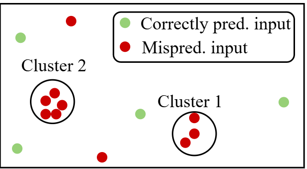
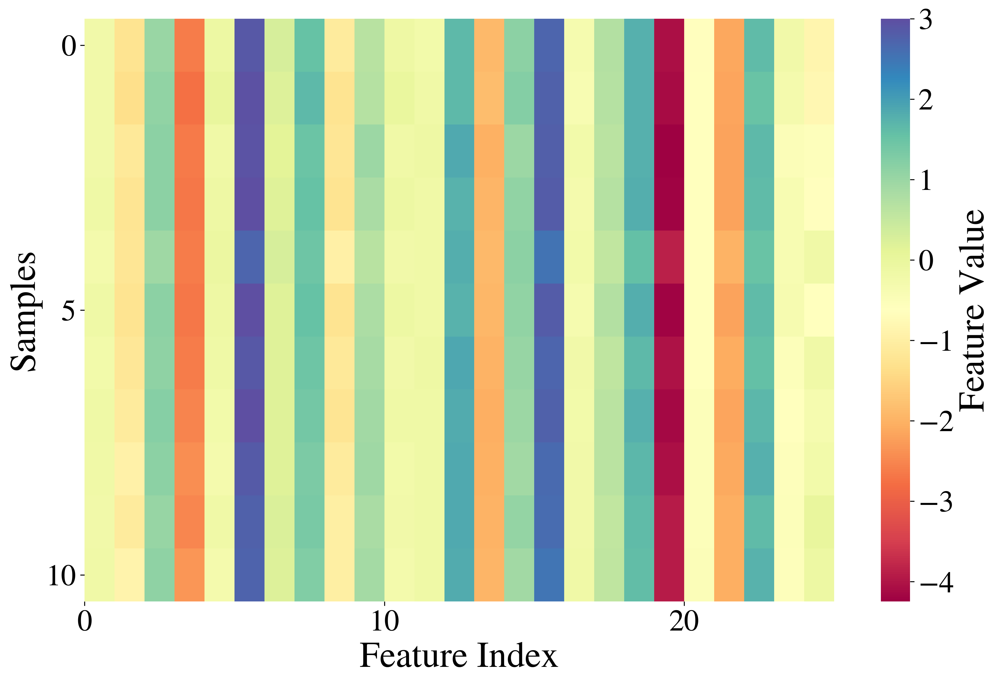
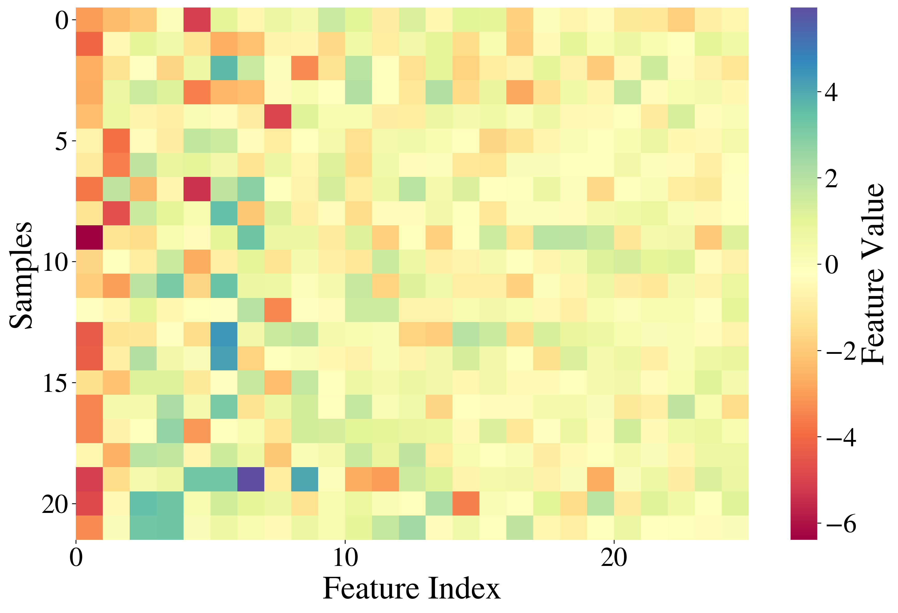
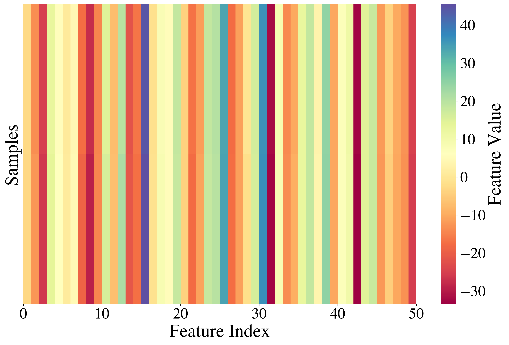
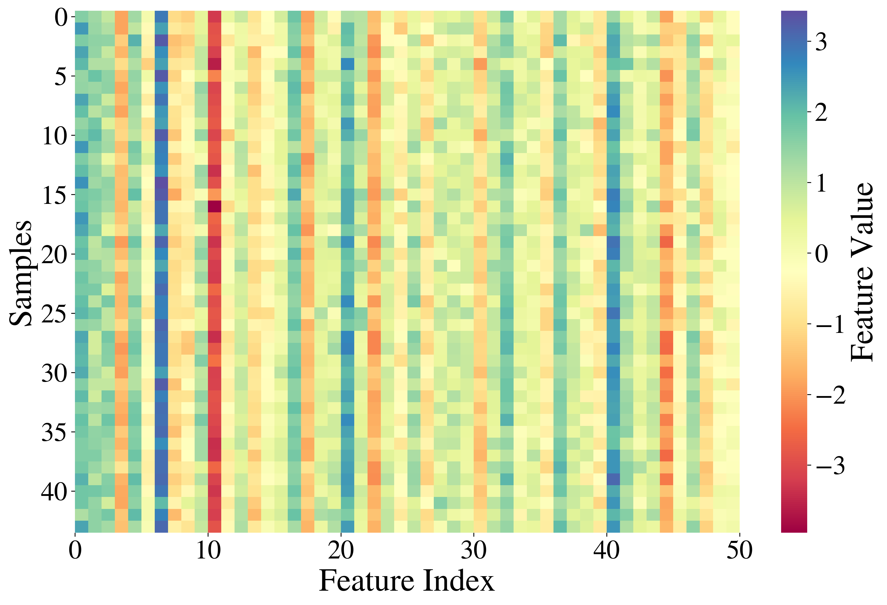

# TestingBenchmark
This repository contains experiments conducted in the paper 'Empirical Insights of Test Selection Metrics under Multiple Testing Objectives and Distribution Shifts'.

### Abstract

Deep learning (DL)-based systems can exhibit unexpected behavior when exposed to out-of-distribution (OOD) scenarios, posing serious risks in safety-critical domains such as malware detection and autonomous driving. This underscores the importance of thoroughly testing such systems before deployment. To this end, researchers have proposed a wide range of test selection metrics designed to effectively select inputs. However, prior evaluations of metrics reveal three key limitations: (1) narrow testing objectives, for example, many studies assess metrics only for fault detection, leaving their effectiveness for performance estimation unclear; (2) limited coverage of OOD scenarios, with natural and label shifts are rarely considered; (3) Biased dataset selection, where most work focuses on image data while other modalities remain underexplored. Consequently, a unified benchmark that examines how these metrics perform under multiple testing objectives, diverse OOD scenarios, and different data modalities is still lacking. This leaves practitioners uncertain about which test selection metrics are most suitable for their specific objectives and contexts. To address this gap, we conduct an extensive empirical study of 15 existing metrics, evaluating them under three testing objectives (fault detection, performance estimation, and retraining guidance), five types of OOD scenarios (corrupted, adversarial, temporal, natural, and label shifts), three data modalities (image, text, and Android packages), and 13 DL models. In total, our study encompasses 1,640 experimental scenarios, offering a comprehensive evaluation and statistical analysis. 

### Conceptual Visualization of Clusters
To enhance the understanding of a fault in the DNN, we provide a 2-dimensional visualization of the concept. In short, a fault is defined as the cause of DNN mispredictions, which can be estimated through a cluster of similar mispredicted samples in the feature space. In the plot, each **red ball** represents a *mispredicted* sample, each **green ball** represents a *correctly predicted* sample, and a **black circle** encompassing red balls denotes a *cluster*.



### Hyperparameters in Clustering Pipelines
To supplement paper results, we provide optimal hyperparameter values and their corresponding selection methods used for each candidate pipelines. This ensures a fair comparison between pipelines. Note that, for MNIST and Udacity, we only report optimal values under the best pipeline suggested by [3].

| Methods   | Descriptions          | Candidate values    | Selection   | AndroZoo | IMDb | MNIST | Udacity |
|-----------|-----------------------|---------------------|-------------|----------|----------------------|-----------------------|---------------------|
| **UMAP**  | Number of Components  | [5,10,25,50,75,100] | grid search | 25        | 50                   | 25                    | 50                   |
|           | Minimum Distance      | [0.01,0.1,0.3,0.5]  | grid search | 0.1        | 0.1                  | 0.1                   | 0.1                   |
|           | Number of Neighbors   | [5,15,25,50]        | grid search | 15        | 15                   | 15                    | 15                   |
| **PCA**   | Number of Components  | [5,10,25,50,75,100] | grid search | 25        | 50                   | –                     | –                  |
| **GRP**   | Number of Components  | [5,10,25,50,75,100] | grid search | 25        |  50                    | –                     |  –                |
| **DBSCAN**| Minimum Neighbors     | [2,5,10,15]         | grid search | 2        |  2                    | –                     | –                   |
|           | Distance Threshold    | -                   | knee-point  | Varied   | Varied               | Varied                 | Varied              |
| **HDBSCAN**| Minimum Cluster Size  | [2,5,10,15]         | grid search | 2       | 2                    | –                     | –                   |
| **HAC**   | Number of Clusters    | range[5,35]         | knee-point  | 10       |13                   | –                      | –                  |
| **K-Means**| Number of Clusters    | range[5,35]         | knee-point  | 9       | 13                   | –                     | –                  |

**Knee-point** is a hyperparameter tuning method that selects the optimal value at the elbow/knee of a metric curve [1]. **Grid search** is a hyperparameter tuning method that exhaustively tries all candidate values within a predefined set [2].  

### Detailed implementation of test selection metrics
This section provides a detailed explanation of implementation choices we made for some metrics in the experiments. For full implementation, please directly refer to the source code.

- **DeepEST (EST)**  
  - *Classification (MNIST, AndroZoo, IMDb)*: DSA + confidence as auxiliary variable (best performance reported in the original paper).  
  - *Regression (Udacity)*: LSA as auxiliary variable since softmax is undefined in the regression task.

- **NC (2017), KMNC (2018)** — For all datasets, we use neurons in the `last hidden layer` to reduce computational cost. We set the neuron activation threshold at `t = 0.75` in NC as in the original paper, and we divide coverage for each neuron into `K = 100` sections in KMNC for efficiency.
- **GD (2023), STD (2023)**
  - *MNIST / Udacity*: We follow the original implementation, which uses VGG-16 to extract features for image data in a black-box manner. Specifically, we use the activation value on the **layer after the last convolutional layer** as features.  
  - *AndroZoo / IMDb*: we use pre-trained DeepDrebin / Transformer model with the first hidden layer to extract features. We use shallow-layer features to capture input-level diversity [9].

- **LSA, DSA (2019)** — For MNIST, AndroZoo, and IMDb, we use last hidden layer activations; For Udacity, we use the penultimate hidden layer activations.

- **DAT (2022)** — Implementation of OOD detectors:
  We utilize existing pre-trained models to conduct semi-supervised, distance-based OOD detection by using intermediate features, which is widely used in the literature due to its simplicity and effectiveness [4], [5]. We compute the Euclidean distance to the centroid of ID features from the training set. Samples with distances exceeding 95\% thresholds value are classified as OOD. We report the AUC-ROC score for performance check.
  - *MNIST*: 2nd hidden layer of LeNet-1 as the feature extractor. ;  AUC-ROC 85.09% with Fashion-MNIST as OOD.  
  - *AndroZoo*: 2nd hidden layer of DeepDrebin as the feature extractor; AUC-ROC 99.78% with FGSM adversarial samples as OOD.  
  - *IMDb*: raw, pre-processed text features; AUC-ROC 70.89% with corrupted text as OOD.
  - *Udacity*: Not applicable.

### Heatmap Visualizations for MNIST and IMDb
<table>
<tr>
<td align="center">
  <br/>
  <sub>Figure 1: MNIST (best)</sub>
</td>
<td align="center">
  <br/>
  <sub>Figure 2: MNIST (other)</sub>
</td>
</tr>
</table>

<table>
<tr>
<td align="center">
  <br/>
  <sub>Figure 1: IMDb (best)</sub>
</td>
<td align="center">
  <br/>
  <sub>Figure 2: IMDb (other)</sub>
</td>
</tr>
</table>

MNIST (best) is obtained from the pipeline ResNet-50, UMAP, DBSCAN; MNIST (other) draws a random cluster from the pipeline ResNet-50, PCA, K-Means.
IMDb (best): RoBERTa, UMAP, DBSCAN; IMDb (other): ELECTRA, GRP, K-Means. 
In summary, the patterns shown are similar to the heatmaps of Udacity and AndroZoo, demonstrated in the manuscript.
## Experiments
### RQ1. Preliminary analysis.
- **[MNIST]** RQ1.1. Heatmap Visualization. ```python3 heatmap_cluster.py --model lenet1 --FE resnet50 --DR UMAP --CA dbscan```. Retraining on clusters C_i and C_j.  ```python3 retrain_cluster.py --dataset mnist --model lenet1```. Model can be selected from choices [lenet1, lenet4, lenet5].
- **[Udacity]** RQ1.1. Heatmap Visualization. ```python3 heatmap_cluster.py --model dave2v1 --FE resnet50 --DR UMAP --CA dbscan```. Retraining on clusters C_i and C_j.  ```python3 retrain_cluster.py --dataset udacity --model dave2v1```. Model can be selected from choices [dave2v1, dave2v2, dave2v3, epoch].
- **[IMDb]** RQ1.1. The clustering quality & heatmap visualization. ```python3 cluster_pipeline_validation.py --model transformer --FE roberta --DR UMAP --CA dbscan```. Retraining on clusters C_i and C_j.  ```python3 retrain_cluster.py --dataset imdb --model transformer```. Model can be selected from [gru, lstm, transformer, linear].
- **[Andro]** RQ1.1. The clustering quality & heatmap visualization. ```python3 cluster_pipeline_validation.py --model deepdrebin --FE deepdrebin --DR UMAP --CA dbscan```. Retraining on clusters C_i and C_j.  ```python3 retrain_cluster.py --dataset andro --model deepdrebin```. Model can be selected from [deepdrebin, basic_dnn].

### RQ2. Test selection and evaluation under three testing objectives.
- **[MNIST]** Select test suites by 15 test selection metrics with 4 budgets ```python3 mnist_exp.py --exp select```. Evaluate the selected test suites by computing #Mis., AE%, Acc.%: ```python3 mnist_exp.py --exp evaluate```. To compute #Clu., run ```python3 mnist_exp.py --exp evaluate_cluster```. This will also compute the Silhoueete and DBCV scores.
- **[Udacity]** Select test suites by 15 test selection metrics with 4 budgets```python3 driving_exp.py --exp select```. Evaluate the selected test suites by computing #Mis., AE%, Acc.%: ```python3 driving_exp.py --exp evaluate```. To compute #Clu., run ```python3 driving_exp.py --exp evaluate_cluster```. This will also compute the Silhoueete and DBCV scores.
- **[IMDb]** Selection ```python3 imdb_exp.py --exp select```. Evaluation ```python3 imdb_exp.py --exp evaluate``` and ```python3 imdb_exp.py --exp evaluate_cluster```.
- **[Andro]** Selection ```python3 malware_exp.py --exp select```. Evaluation ```python3 malware_exp.py --exp evaluate``` and ```python3 malware_exp.py --exp evaluate_cluster```.

### RQ3. Budget sensitivity.
For all datasets, run ```python3 budget_plot.py```

### RQ4. Time efficiency.
Compute time efficiency of selection metrics:
- **[MNIST]**  ```python3 mnist_exp.py --exp time_efficiency```
- **[Udacity]** ```python3 driving_exp.py --exp time_efficiency```
- **[IMDb]** ```python3 imdb_exp.py --exp time_efficiency```
- **[Andro]** ```python3 malware_exp.py --exp time_efficiency```

### References
[1]: Satopää, V., Albrecht, J., Irwin, D., & Raghavan, B. (2011). *Finding a “Kneedle” in a Haystack: Detecting Knee Points in System Behavior*. ICDCS Workshops, 166–171.                                                                                                    
[2]: Bergstra, J., & Bengio, Y. (2012). *Random Search for Hyper-Parameter Optimization*. JMLR, 13, 281–305.  
[3]: Attaoui, M., Fahmy, H., Pastore, F., & Briand, L. (2023). *Black-box safety analysis and retraining of DNNs based on feature extraction and clustering*. ACM Transactions on Software Engineering and Methodology, 32(3), 1–40.  
[4]: Y. Sun, Y. Ming, X. Zhu, and Y. Li. (2022). *Out-of-distribution detection with deep nearest neighbors*. In International Conference on Machine Learning.     
[5]: L. Ruff, R. Vandermeulen, N. Goernitz, L. Deecke, S. A. Siddiqui, A. Binder, E. M¨uller, and M. Kloft. (2018). *Deep one-class classification*. In International Conference on Machine Learning. 
